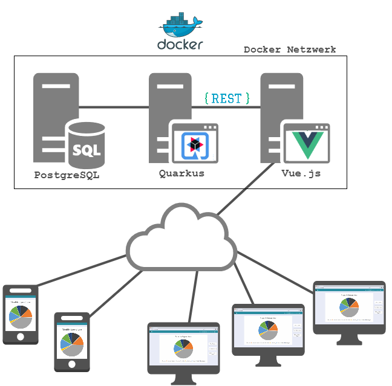

# IncomeExpensesAccounting - IEA </img>

## :bookmark_tabs: Übersicht
- [Was ist IEA?](#money_with_wings-was-ist-iea)
- [Systemarchitektur](#statue_of_liberty-systemarchitektur)
- [Funktionsweise](#chart_with_upwards_trend-funktionsweise)
- [Konfiguration](#wrench-konfiguration)
- [Das Team](#guardsman-das-team)
- [Lizenz](#closed_lock_with_key-lizenz)

## :money_with_wings: Was ist IEA?
IncomeExpensesAccounting (IEA) ist ein Einnahmen & Ausgabenprogramm, welches einen Überblick über die gesamten Finanzen schafft.

## :statue_of_liberty: Systemarchitektur


## :chart_with_upwards_trend: Funktionsweise


### :newspaper: Erklärung
Die Zahlungen werden von der Bank als csv-File zur Verfügung gestellt und müssen auf Buchungen aufgeteilt werden. Dabei werden zwei Fälle unterschieden: 
Fall A: Eine Zahlung kann automatisiert (ev. auch manuell) auf ein Konto gebucht werden (sachliche Abgrenzung), sowie dem richtigen Jahr zugeordnet werden.  
Fall B: Manche Zahlungen betreffen aber nicht nur das Jahr der Zahlung, sondern werden über mehrere Jahre hinweg abgeschrieben: PCs im Wert von 30.000 EUR werden bspw. drei Jahre genutzt und für diesen Zeitraum abgeschrieben, d.h. es entsteht ein Aufwand von 10.000 EUR pro Jahr. 
Damit eine solche Abschreibung möglich ist gibt es Kontenarten wie Aufwands- und Ertragskonten. In die Aufwandskonten werden die negativen Beträge gebucht, die positiven Beträge werden ins Ertragskonto gebucht.
Bestandskonten werden wir in weiterer Folge auch noch brauchen um die Anschaffungskosten der Investitionsgüter zu verbuchen, diese sind jedoch momentan noch unwichtig.

## :wrench: Konfiguration

### :computer: Inbetriebnahme des JEE-Servers

#### DB starten

```
cd db/
/opt/derbydb/bin/startNetworkServer -noSecurityManager
```

#### Wildfly konfigurieren

- In der Toolbar auf "Add Configuration..." klicken
- JBoss-server local hinzufügen
- Darauf achten, dass der wildfly server mit der ip `localhost:8085` konfiguriert ist

#### JEE-Server starten bzw. stoppen

- Starten: in der Toolbar auf "Run" klicken
- Stoppen: in der Toolbar auf "Stop" klicken


### :computer: Inbetriebnahme des Webservers

- Webserver projekt in der Webstorm IDE öffnen
- Ins root-verzeichnis wechseln
```
cd wwwroot/
```
- Pakete installieren
```
npm i
```

#### Webserver testen

- Ins root-verzeichnis wechseln
```
cd wwwroot/
```
- Polymer starten
```
npm start
```

#### Nginx-server starten

- Polymer build aufrufen
```
polymer build
```
- Docker starten

```
docker-compose up
```

#### Seite im Browser öffnen

- Im Browser `localhost:80` eingeben

#### Nginx-server stoppen

- Docker herunterfahren 

```
docker-compose down
```

## :guardsman: Das Team
- Michael Frech
- Julian Nobis

## :closed_lock_with_key: Lizenz

[MIT License](LICENSE)


