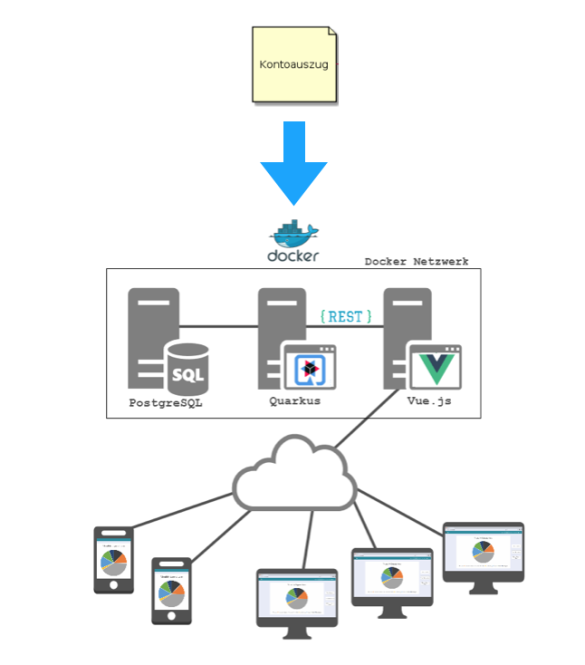

= Income Expenses Accounting
Michael Frech & Julian Nobis
1.0.0, 2020-03-19
:sourcedir: ../src/main/java
:icons: font
:toc: left

== Pflichtenheft "Was mache ich?"

=== Ausgangssituation
Mit einem Einnahmen- & Ausgabenprogramm erhält man einen Überblick über die eigenen Finanzen. 

=== Istzustand
Die Zahlungen werden von der Bank zur Verfügung gestellt und automatisch verbucht.

=== Problemstellung
Manche Zahlungen betreffen aber nicht nur das Jahr der Zahlung, sondern werden über mehrere Jahre hinweg abgeschrieben. 
PCs im Wert von 30.000 EUR werden bspw. drei Jahre genutzt und für diesen Zeitraum abgeschrieben, d.h. es entsteht ein Aufwand von 10.000 EUR pro Jahr.

=== Aufgabenstellung
==== Funktionale Anforderungen

* *Einnahmen und Ausgaben ansehen*
* *Manuelle Buchungen durchführen*
* *Kontrolle der vorkontierten Buchungen*
* *Strukturierung der Einnahmen und Ausgaben*

Im Kapitel *<<Anwendungsfalldiagramm>>* werden die funktionalen Anforderungen ebenfalls verdeutlicht.

_Da sich das Entwickler-Team (Micheal Frech, Julian Nobis) nicht sicher war (siehe E-Mail), wurden die funktionalen Anforderungen hier aufgezählt und beim <<Anwendungsfalldiagramm>> grafisch dargestellt._

==== Nichtfunktionale Anforderungen (NFA)
===== Rahmenbedingungen
Das Entwickler-Team besteht aus den zwei oben genannten Personen. 
Gestartet wurde das Projekt mit im November 2018, die Fertigstellung erfolgt mit Schulende - voraussichtlich 30. April 2020.
Beide Entwickler besitzen ausreichend fundiertes Rechnungswesen Know-How.

===== Robustheit und Ausfallsicherheit
Das Projekt läuft in einem Docker-Netzwerk, wie die Abbildung in Kapitel <<Systemarchitektur>> verdeutlicht. Deshalb kann das Projekt einmal gestartet werden und läuft so lange, bis es terminiert wird.

=== Ziele
Eine sachliche sowie zeitliche Abgrenzung der Zahlungen im CAMT 053 Format, welche bei Bedarf manuell umgebucht werden können. Anschließend erfolgt eine Visualisierung der Zahlungen.

=== Mengengerüst
Zu Beginn wird eine Datei im CAMT 053 Format vom System eingelesen, analysiert und anschließend in einer PostgreSQL Datenbank persistiert. Die Datenmenge, mit der das System _arbeitet_, stellt für die Datenbank kein Problem dar, da eine PostgreSQL Datenbank in der Praxis für Onlinebanking-Systeme eingesetzt wird. _Quelle: https://www.ionos.at/digitalguide/server/knowhow/postgresql/_ 

Außerdem kann davon ausgegangen werden, dass die Datei Zahlungen in einem monatlichen bzw. jährlichen Zeitraum enthält.

== Entwurf "Wie mache ich es?"
=== Systemarchitektur

=== Anwendungsfalldiagramm
image::images/IEA_use_case_diagram.png[Anwendungsfalldiagramm]
=== Entity-Relationship-Modell
=== Funktionsweise
image::images/function.png[Funktionsweise]

== Projekthandbuch "Organisatorische Rahmenbedingungen"

=== GANTT-Diagramm

mit User-Stories (definiert in YouTrack)

[plantuml,gantt-protoype,png]
----
@startuml
[Test prototype] lasts 10 days
[Prototype completed] happens at [Test prototype]'s end
[Setup assembly line] lasts 12 days
[Setup assembly line] starts at [Test prototype]'s end
[Test prototype 2] lasts 3 days
[Test prototype 2] starts at [Prototype completed]'s end
@enduml
----

link:demo.html[Demo]
